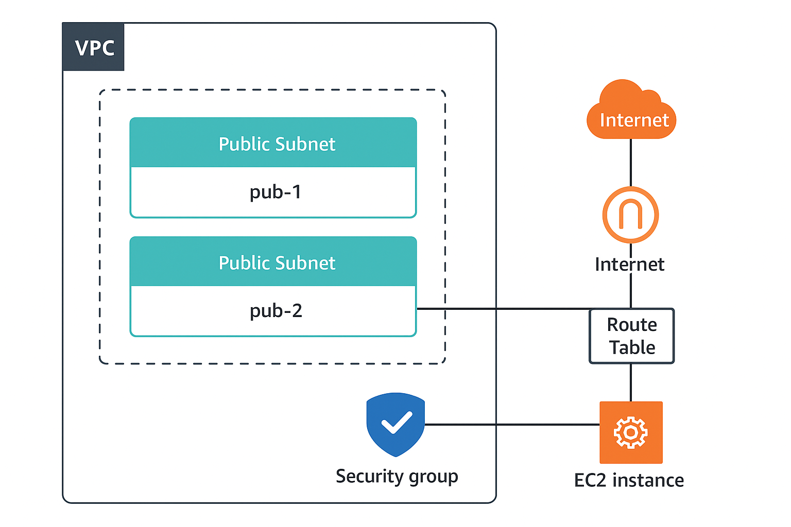
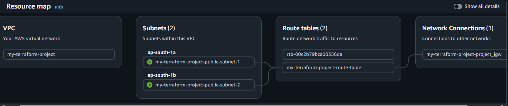
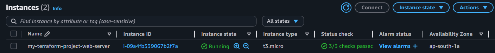
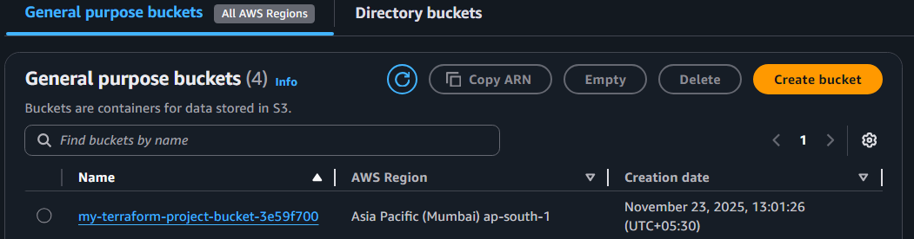

# AWS Multi-Tier Infrastructure using Terraform

Infrastructure as Code (IaC) project built using Terraform to automate the deployment of AWS networking, compute, storage, and access management resources.

---

## Project Structure

  

---

## Infrastructure Deployed

### 1. VPC & Networking

- Custom VPC (10.0.0.0/16)
- Two public subnets across different Availability Zones
- Internet Gateway for internet connectivity
- Public Route Table with subnet associations

  

---

### 2. EC2 Compute Layer

- EC2 instance deployed in a public subnet
- Apache2 automatically installed and configured using a `user_data.sh` script
- Simple landing page generated during provisioning to verify successful deployment
- SSH access enabled using an existing key pair
- IAM Role attached to provide secure read/write access to the S3 bucket

  

---

### 3. S3 Storage Layer

- S3 bucket created automatically using Terraform
- IAM Role grants the EC2 instance read/write access to the bucket
- Bucket name generated dynamically during deployment

  

---

## Tech Stack

- Terraform v1.x
- AWS Provider v5.x
- AWS EC2
- AWS VPC
- AWS S3
- AWS IAM
- Ubuntu Server
- Apache2
- Bash (User Data Script)

---

## Key Concepts Demonstrated

- Infrastructure as Code (Terraform)
- AWS Networking (VPC, Subnets, Route Tables, Internet Gateway)
- EC2 Provisioning and Configuration
- IAM Role-based Access Control
- S3 Storage Integration
- Automated Server Bootstrapping using User Data Scripts
